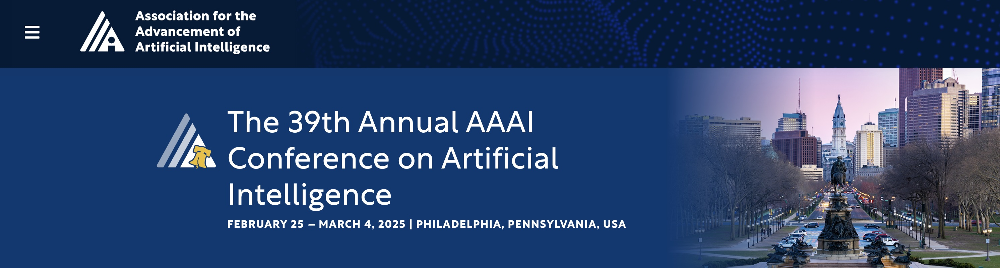
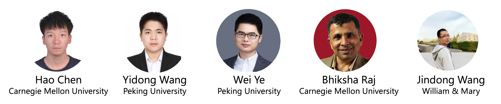
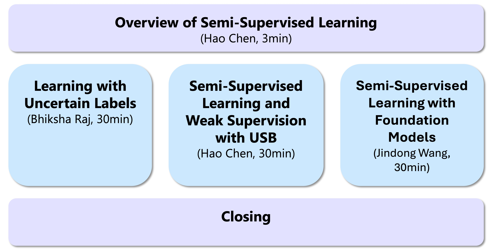

# Unified Semi-Supervised Learning with Foundation Models

- Room 115A, Philadelphia Convention Center, PA, USA
- 8:30am-10:15am, February 25, 2025

## Presenters

- [Hao Chen](https://hhhhhhao.github.io/), Carnegie Mellon University, haoc3 (at) andrew.cmu.edu
- [Yidong Wang](https://qianlanwyd.github.io/), Peking University, yidongwang37 (at) gmail.com
- [Wei Ye](https://yanglinyi.github.io/), Peking University, wye (at) pku.edu.cn
- [Bhiksha Raj](https://cmu-mlsp.github.io/team/bhiksha_raj), Carnegie Mellon University, bhiksha (at) cs.cmu.edu
- [Jindong Wang](https://jd92.wang/), William & Mary, jwang80 (at) wm.edu

## Contents at a glance

Slides will be available soon.

